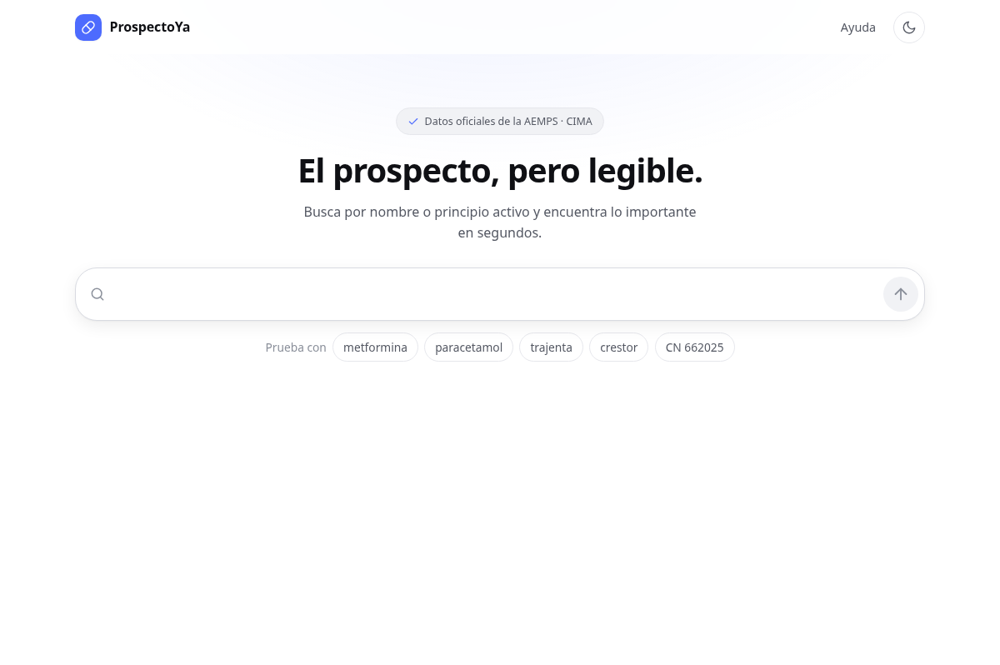

# ProspectoYa — Web mejorada para consultar medicamentos

<!-- Captura del sitio real (1200x798). Va en la raíz del repo, con ruta
     relativa, para que se vea también al clonar o hacer fork. -->


Web estática (HTML/CSS/JS vanilla, sin frameworks, sin build) que consulta
la API pública de CIMA (AEMPS) para mejorar la experiencia de buscar y leer
fichas técnicas y prospectos de medicamentos autorizados en España.

## Contexto técnico

- **Sin backend.** La API de CIMA responde con `Access-Control-Allow-Origin: *`,
  así que todas las llamadas se hacen directamente desde el navegador con `fetch`.
- **Sin IA integrada.** Se decidió NO incluir un chat con IA dentro de la app
  (evita coste de tokens y complejidad de backend). En su lugar, se ofrece un
  botón para copiar el texto del prospecto/sección en formato limpio, para que
  el usuario lo pegue en la IA que prefiera.
- **Deploy:** Vercel, hosting estático, sin build step.
- **Sin autenticación ni base de datos.** Todo el estado del usuario
  (búsquedas recientes, "mi botiquín") vive en `localStorage`.

## API de CIMA — referencia rápida

Base: `https://cima.aemps.es/cima/rest/`

| Endpoint | Uso |
|---|---|
| `GET /medicamentos?nombre=X` | Búsqueda de medicamentos (también admite `practiv1`, `laboratorio`, `atc`, `cn`, `nregistro`, etc.) |
| `GET /presentaciones?{filtros}` | Presentaciones (envases) **con su `cn`** (Código Nacional); acepta los mismos filtros que `/medicamentos` (`nombre`, `cn`, `nregistro`, `pactivos`…) |
| `GET /medicamento?nregistro=X` | Ficha completa de un medicamento (incluye `docs[]` con enlaces a PDF de ficha técnica y prospecto) |
| `GET /docSegmentado/secciones/2?nregistro=X` | Lista de secciones disponibles del PROSPECTO (tipoDoc=2) |
| `GET /docSegmentado/contenido/2?nregistro=X&seccion=X` | Contenido HTML de una sección del prospecto |
| `GET /docSegmentado/secciones/1?nregistro=X` | Lista de secciones de la FICHA TÉCNICA (tipoDoc=1) |
| `GET /docSegmentado/contenido/1?nregistro=X&seccion=X` | Contenido HTML de una sección de la ficha técnica |
| `GET /psuministro?cn=X` | Problemas de suministro activos para un Código Nacional |
| `GET /vmpp?nregistro=X` | Equivalentes clínicos (para "medicamentos equivalentes") |
| `GET /maestras?maestra=X` | Catálogos: ATC, principios activos, laboratorios, formas farmacéuticas |

Documentación oficial completa (PDF): `CIMA-REST-API_1_19.pdf` (AEMPS).

## Prioridades del MVP (Fase 1)

1. Buscador con autocompletado en tiempo real (`GET /medicamentos`), también por
   código nacional (CN) y nº de registro (`GET /presentaciones`). ✅
2. Visor del prospecto/ficha técnica por secciones, tipo acordeón/tabs
   (usando `docSegmentado/secciones` + `docSegmentado/contenido`). ✅
3. Resumen rápido arriba de la ficha: dosis, contraindicaciones, alertas
   clave (embarazo, conducción) extraídas de las secciones correspondientes
   del prospecto. ✅

### Cómo funciona el buscador (`app.js`)

- El buscador es un *composer* de una línea inspirado en ChatGPT/DeepSeek: lupa
  a la izquierda, botón circular con flecha ↑ a la derecha (`#search-submit`) y
  chips de ejemplo ("Prueba con…") debajo. El botón queda `disabled` mientras el
  input esté vacío y se activa en cuanto hay texto.
- **El campo no lleva texto dentro** (sin placeholder, a propósito): se explica
  con la lupa de la izquierda y con su etiqueta accesible, así que no hace falta
  —y en el móvil se cortaba a medias—. Los cinco chips de ejemplo son
  *metformina*, *paracetamol*, *trajenta*, *crestor* y *CN 662025* (el prefijo
  identifica el código nacional dentro del propio chip; `data-ejemplo` se
  queda solo con los dígitos, que es lo que de verdad se busca); los cinco
  devuelven resultados en la API.
- Al escribir 3 letras o más se consulta `GET /medicamentos` con un *debounce*
  de 300 ms y se pinta el desplegable `#search-suggestions` (máx.
  `MAX_SUGERENCIAS` = 8). Con menos de 3 letras el desplegable se oculta.
- **Búsqueda por código**: si lo escrito son sólo dígitos, `consultarSegunTermino()`
  espera a tener al menos 5 dígitos antes de consultar (por debajo avisa, porque la
  API ignora los filtros vacíos y devolvería el catálogo completo). Con 6 dígitos
  busca por **código nacional** en `GET /presentaciones?cn=…` (coincidencia
  exacta) y, si no hay nada, reintenta como nº de registro; con el resto de
  longitudes (5 o 8-10 dígitos) va directo a `GET /medicamentos?nregistro=…`.
- **El CN sale en cada resultado** (`.result-cn`): las respuestas de
  `/presentaciones` ya lo traen (búsquedas por CN, con el nombre del envase); en
  las búsquedas por nombre se pide en diferido, medicamento a medicamento,
  cuando el resultado entra en pantalla (`IntersectionObserver`, con
  `MAX_CNS_SIN_OBSERVADOR` como respaldo si el navegador no lo soporta) y queda
  en caché (`cacheCN`, `nregistro → CN[]`). La ficha del medicamento lista todos
  los CN de sus envases (`#detail-cn`) reutilizando esa misma caché, así que
  abrir un resultado ya visto no gasta peticiones.
- Teclado: ↑ / ↓ recorren las sugerencias (realce `.is-active`, equivalente al
  hover, que además actualiza `aria-activedescendant`), Enter abre la sugerencia
  marcada o lanza la búsqueda completa si no hay ninguna, y Escape cierra el
  desplegable. Un clic fuera del composer también lo cierra.
- Semántica ARIA: `#search-input` es `role="combobox"` y la lista es
  `role="listbox"` con cada `li` como `role="option"`, así que el autocompletado
  funciona con lectores de pantalla sin sacar el foco del input.
- Toda la interacción está cubierta por un test de humo en jsdom que carga
  `index.html` + `tema.js` + `api.js` + `app.js` con `fetch` simulado; vive en
  [`tests/`](tests/README.md) (ver [Tests](#tests)).


### Cómo funciona el resumen rápido (`app.js`)

- La configuración vive en `CAMPOS_RESUMEN`: un array con un objeto por tarjeta
  (`etiqueta`, patrones de `secciones`, `subTitulos`, `frases`, límite de
  longitud…). Añadir un campo nuevo = añadir un objeto ahí, sin tocar el resto.
- Para cada campo, `buscarCampo()` prueba por orden: **subtítulo** del prospecto
  → **frase** que mencione la palabra clave (`extraerPorFrases`) → **sección
  completa** (`seccionCompleta`, solo si la sección es específica del tema, p.ej.
  "4.3 Contraindicaciones" de la ficha técnica) → **primeros bloques** de la
  sección (caso de la posología).
- El prospecto se consulta primero (lenguaje para el paciente) y, solo si queda
  algún campo vacío, se usa la **ficha técnica** como respaldo. Cada tarjeta
  indica de qué documento y sección salió el texto.
- El HTML se trocea con `DOMParser` + `extraerBloques()`, que detecta como
  subtítulo cualquier párrafo cuyo contenido vaya entero en negrita/subrayado
  (cubre las dos variantes de CIMA). El texto de las tarjetas se pinta siempre
  con `textContent`, nunca con `innerHTML`.

### Páginas, tema y ayuda (`ayuda.html`, `tema.js`)

- El sitio tiene **dos páginas**: el buscador (`index.html`) y la **ayuda**
  (`ayuda.html`), que explica de dónde salen los datos, cómo se busca (nombre,
  CN, nº de registro), cómo se lee el resumen rápido, atajos de teclado, FAQ y
  aviso sanitario, y termina con el enlace al repositorio. Se llega a ella desde
  el enlace *Ayuda* de la barra superior (y vuelve con *← Volver al buscador*).
- **El buscador no lleva pie** (a propósito, para que la interfaz quede limpia):
  el aviso sanitario ("esta web no da consejo médico") vive en la ayuda y la
  fuente de datos se cita en el badge del hero («Datos oficiales de la AEMPS ·
  CIMA»). `test-html.js` lo comprueba en las dos direcciones: sin pie en el
  buscador y con pie en la ayuda.
- `ayuda.html` **no carga `api.js` ni `app.js`**: son solo texto y estilos. Lo
  único de comportamiento que necesita es el botón de tema, que vive en
  `tema.js`.
- **`tema.js` es el único sitio donde se decide el tema** (clave `prospectoya-tema`
  en `localStorage` + atributo `data-tema` en `<html>`): lo cargan las dos páginas,
  así que el tema elegido en una se mantiene al pasar a la otra. El script en línea
  del `<head>` de cada página (el que evita el destello al cargar) lee esa **misma**
  clave: si se cambia en un sitio, hay que cambiarla en los tres.
- Los estilos de la ayuda (`.ayuda`, `.ayuda-tabla`, `.kbd`, `.nota`, `.aviso`) y
  los enlaces de la barra (`.topbar-nav`, `.topbar-link`) están al final de
  `styles.css`, reutilizando los mismos tokens de color que el resto.
- **Metaetiquetas para compartir** (`index.html`): `og:title`, `og:description`,
  `og:url`, `og:image` —la misma imagen que el *Social preview* del
  repositorio—, `og:image:width/height` y el bloque `twitter:card`. `og:image`
  exige **URL absoluta**, así que apunta a `https://prospectoya.vercel.app/…`: si
  el dominio cambia, hay que actualizarlo ahí.

### Resoluciones de pantalla (`styles.css`)

La web se ve igual de bien en un móvil de 320px que en un monitor de 2560: no hay
scroll horizontal a ningún ancho y sólo hay **dos grupos de reglas** (lo demás
sale de `clamp()`, de `auto-fit` y de los tokens).

- **Móvil (≤640px)**: una sola columna, el buscador a lo ancho (y más bajo que en
  el escritorio: 56px), las pestañas del documento repartidas
  (`@media (max-width: 640px)`) y el detalle a pantalla completa. Mientras no hay
  resultados, el `body` es una columna de `100dvh`: el bloque de arriba (hero +
  buscador + chips) lleva un **hueco de arriba fijo y pequeño** (4rem) que no
  crece con el alto de la pantalla, y el hueco sobrante entero (no la mitad) lo
  absorbe el **margen automático** de la lista de resultados por debajo —vale 0
  en cuanto hay lista, así que la página se ve como siempre—.
- **Escritorio normal (641–1179px)**: la columna de siempre (`--medida` = 780px).
- **Pantallas grandes (≥1180px)**: `--medida` crece (1060px; 1260px a partir de
  1500px; 1400px a partir de 1900px) y los resultados pasan a una rejilla de varias
  columnas, que es en lo que se aprovecha el ancho.
- **El detalle se sale del flujo**: se abre en una ventana centrada (`<dialog>`
  nativo con `showModal()`), así que no compite con los resultados por el ancho.
  La ventana mide `--medida-detalle` = `--medida-texto` (44rem) + el relleno de la
  tarjeta = 742px: es, literalmente, el renglón cómodo del prospecto, así que el
  texto **llena** su tarjeta de lado a lado y no queda hueco. (Con la columna de
  808px que se probó antes, el renglón se quedaba en 704px y sobraban 67px a la
  derecha dentro de la tarjeta: eso era lo que se veía descentrado.) En el móvil la
  ventana es la pantalla entera.

Medido en Chrome (lo comprueba `test-resoluciones.js`, que también sirve de
resumen de lo que se espera de cada ancho):

| Ancho de ventana | Contenedor | Resultados | Ventana del detalle |
|---|---|---|---|
| 900px | 780px | una columna | 742px, centrada |
| 1180px | 1060px | 2 columnas | 742px, centrada |
| 1600px | 1260px | 3 columnas | 742px, centrada |
| 2560px | 1400px | 4 columnas | 742px, centrada |

Con la ventana abierta, los resultados **siguen** repartidos en esas columnas
(el fondo queda inerte, pero no cambia de sitio).

### Botón de "volver arriba" (`arriba.js`)

Abajo a la derecha de las dos páginas hay un botón redondo que devuelve al
principio de la web. `arriba.js` es el encargado de enseñarlo y ocultarlo (a
partir de 400px de bajada) y de dar la orden de subir; el botón, que es un
`<button>`, vive en el HTML de cada página (`#btn-subir`).

- **Se sube con `window.scrollTo({ top: 0 })`**: no recarga la página ni añade
  nada a la URL (nada de enlaces `#`), así que no rompe el botón "atrás" ni
  pierde el estado del buscador.
- **Con teclado no se queda a medias**: mientras el botón tiene el foco no se
  oculta (si no, al pulsarlo con Enter desaparecería y el foco se perdería); se
  oculta cuando el usuario se va de él.
- **Respeta `prefers-reduced-motion`**: si el sistema pide menos movimiento,
  sube de golpe en vez de con animación (la animación no es CSS, así que no la
  cubre la media query de `styles.css`).
- **No tapa el aviso de versión**: cuando ese aviso está abajo, el botón se
  aparta (`body:has(.aviso-version:not([hidden]))`).

### App instalable (`manifest.webmanifest`, `sw.js`, `pwa.js`)

La web se puede **instalar** como app (Chrome/Edge en Android y escritorio:
*Instalar*; iPhone/iPad: Compartir → *Añadir a la pantalla de inicio*) y se abre
**sin conexión**, porque guarda su propia "cáscara": las dos páginas, los
estilos, el JS, el manifest y los iconos.

- **`manifest.webmanifest`** declara el nombre, el arranque (`./`, relativo para
  que funcione también en una subcarpeta), `display: standalone` y los cuatro
  iconos. Los colores (`theme_color`, `background_color`) son los mismos tokens
  de `styles.css`, y las páginas añaden dos `<meta name="theme-color">` (claro y
  oscuro) más las etiquetas de iOS (`apple-mobile-web-app-*`).
- **`sw.js`** precachea la cáscara al instalarse y después:
  - las **navegaciones** van primero a la red —así, con conexión, siempre se ve
    lo último publicado— y, si fallan, se sirve la copia guardada;
  - el **resto de ficheros propios** se sirven de la copia y se actualizan en
    segundo plano, sin pasos manuales;
  - **la API de CIMA no se toca**: va directa a la red y no se guarda nunca (los
    datos tienen que estar frescos). Sin conexión el buscador da error y la
    página lo avisa con el cartel de "sin conexión".
- **`pwa.js`** registra el service worker, enseña u oculta el aviso de conexión
  y avisa cuando hay **versión nueva**: pregunta al service worker en marcha qué
  versión lleva (`VERSION`, en `sw.js`) y, si cambia, muestra abajo *"Hay una
  versión nueva"* con un botón **Recargar**. No recarga sola —puede haber un
  prospecto a medio leer— y sólo avisa si la versión cambia de verdad: hay
  cambios de control (el navegador reactiva o reclama la página) que no son una
  actualización. También llama a `registration.update()` al abrir y al volver a
  la pestaña, porque el navegador, por su cuenta, sólo busca versiones nuevas
  cada 24 h.

**Al publicar cambios**, sube `VERSION` en `sw.js` (por ejemplo `v1` → `v2`): el
caché lleva la versión en el nombre, al activarse se borran los anteriores y
quien tenga la web abierta verá el aviso de recargar. No hace falta nada más: el
sitio se sigue sirviendo tal cual desde el repositorio.

## Fase 2 (después del MVP)

4. Badge de "problema de suministro activo" (`GET /psuministro`).
5. "Mi botiquín": guardar medicamentos frecuentes en `localStorage`.
6. Comparador de dos medicamentos lado a lado.
7. Botón "copiar para IA": vuelca el texto de una sección o del prospecto
   completo en un formato limpio (markdown plano) al portapapeles.

## Formas de respuesta REALES de la API (verificado el 20 y 21/09/2026)

Antes de tocar estas llamadas conviene saber que la API **no coincide con lo que
sugiere el PDF de documentación** en varios puntos:

| Punto | Realidad comprobada |
|---|---|
| CORS | `Access-Control-Allow-Origin: *` presente en todas las llamadas (sin proxy). |
| `GET /docSegmentado/secciones/{tipoDoc}` | Array de `{ seccion, titulo, orden }`. La clave del id es **`seccion`** (string, p.ej. `"4.2"`) y el título viene en **`titulo`**. |
| `GET /docSegmentado/contenido/{tipoDoc}` | **No devuelve HTML plano**: devuelve un array JSON `[{ seccion, titulo, contenido, orden }]` con el HTML dentro de `contenido`. `api.js` ya lo parsea y une los fragmentos. |
| Orden de las secciones | El array ya llega en el orden del documento. **No ordenar por `orden`**: en la ficha técnica ese campo no es monótono (las secciones 4, 4.1, 4.2… comparten valores bajos). |
| `GET /medicamentos?nombre=X` | **`pagina` sí pagina de verdad** (`pagina=2` trae filas distintas de `pagina=1`); lo único que se ignora es `tamanioPagina` (siempre 200 filas por página, pidas lo que pidas). Y `totalFilas` **es el total real del catálogo, no un recorte a 200**: para "comprimidos" devuelve `totalFilas: 13995` con solo 200 `resultados`. El recorte de la lista visible (`MAX_RESULTADOS`) es cosa del cliente, no de la API. **No devuelve `cn`.** |
| `GET /presentaciones?…` | Es el único endpoint que trae el **`cn`**, además del `nombre` del envase ("… , 20 comprimidos"). El filtro `cn` es de **coincidencia exacta** (`?cn=662025` → 1 fila; `?cn=6620` o `?cn=66202500` → 0) y `nregistro` sólo admite **un** valor (`?nregistro=a,b` ni parámetros repetidos → 0 filas). Como `/medicamentos`, sólo `tamanioPagina` se ignora (`pagina` sí funciona) y cada página tope en 200 filas: para una búsqueda por nombre amplia NO cubre todos los medicamentos sin pedir varias páginas (p.ej. "paracetamol": 195 medicamentos vs 84 nregistros en la primera página de presentaciones). Por eso `app.js` pide el CN medicamento a medicamento, cacheado y cuando el resultado entra en pantalla, en vez de paginar. |
| Filtros con valor **vacío** | Se ignoran y se devuelve el catálogo entero: `GET /medicamentos?nregistro=` responde con las **25.464** filas de medicamentos. Nunca llamar con el término vacío (de ahí los avisos de `app.js` para códigos incompletos). |
| Formato de los nº de registro | 5 dígitos en la mayoría de medicamentos, pero también los hay de 8-10 (registros tipo EMA, p.ej. `07428001`, `1231752001`), así que la búsqueda numérica no se limita a 5-6 dígitos. |
| Mayúsculas, acentos y orden | La búsqueda por `nombre` **no distingue mayúsculas ni acentos** (`ibuprofeno`, `IBUPROFENO` y `ibuprofén` dan el mismo `totalFilas`; también `acido acetilsalicilico` y `ácido acetilsalicílico`): no hace falta normalizar el término antes de consultar. El **orden de los resultados es estable** entre llamadas repetidas con el mismo término. |
| Prospecto (tipoDoc=2) | **No existe una sección "Contraindicaciones"**. Todo (contraindicaciones, embarazo, conducción, alcohol) vive dentro de la sección *"Qué necesita saber antes de empezar a tomar…"*, dividido en subtítulos. Además, CIMA alterna `<p><strong>…</strong></p>` y `<ul><li><strong>…</strong></li></ul>` para esos mismos subtítulos. |

## Estructura de archivos

```
index.html         → estructura de la página (buscador, resultados, detalle)
ayuda.html         → página de ayuda: cómo funciona, FAQ y enlace al repositorio
styles.css         → estilos (buscador, detalle, ayuda y avisos)
api.js             → funciones que llaman a la API de CIMA (fetch)
app.js             → lógica de UI: búsqueda, render de resultados, acordeón, resumen
tema.js            → tema claro/oscuro (lo comparten index.html y ayuda.html)
arriba.js          → botón de "volver arriba" (lo comparten las dos páginas)
pwa.js             → app instalable: registra el service worker y los avisos
sw.js              → service worker: guarda la "cáscara" para abrir sin conexión
manifest.webmanifest → ficha de la app (nombre, arranque, colores e iconos)
favicon.svg        → icono maestro (cápsula de marca); de aquí salen los demás
favicon-32.png     → respaldo del icono para navegadores sin soporte de SVG
favicon.ico        → respaldo multi-tamaño (16/32/48) para navegadores antiguos
apple-touch-icon.png → icono para iOS/iPadOS (180×180, opaco)
icono-192.png / icono-512.png → iconos de la app instalada (192×192, 512×512)
icono-maskable-192.png / icono-maskable-512.png → los mismos, con fondo a sangre
                     y la marca centrada: Android los recorta con su máscara
social-preview.png → imagen 1280×640: Social preview del repo y `og:image` de la web
captura-inicio.png → captura del buscador que se muestra al principio del README
LICENSE            → licencia MIT
CHANGELOG.md       → historial de cambios
README.md          → este documento
tests/             → suites de test (jsdom y Chrome real) y la maqueta del social
                     preview; no forman parte del sitio
```

> Los ficheros del **sitio** están **en la raíz** del proyecto (no hay `css/` ni
> `js/`), y `index.html` los referencia con rutas planas. Mantener ambos
> sincronizados: si se mueven a subcarpetas, hay que actualizar las rutas.
> `tests/` es la única subcarpeta y es la excepción: no la carga la web, así que
> no está enlazada desde ninguna página.

### Iconos

`favicon.svg` es el **fichero maestro**: la cápsula del logo en blanco sobre el
azul de marca, en un cuadrado redondeado. Los PNG y el ICO se generan
rasterizándolo, no se editan a mano:

```bash
# 1) Renderizar el SVG a 512 px con fondo transparente
sed 's/width="64" height="64"/width="512" height="512"/' favicon.svg > /tmp/icono-512.svg
google-chrome --headless --window-size=512,512 \
  --default-background-color=00000000 --screenshot=/tmp/icono-512.png \
  file:///tmp/icono-512.svg
```

Después se reduce a 32×32 (`favicon-32.png`) y a 180×180 (`apple-touch-icon.png`,
esta vez **sin** esquinas redondeadas y opaco, porque iOS aplica su propia
máscara), y se empaquetan los tamaños 16/32/48 en `favicon.ico`.

Los cuatro iconos de la app instalada (192 y 512, normales y *maskable*) salen
del mismo SVG. Los **maskable** son los que Android recorta con su máscara
(círculo, gota, cuadrado redondeado…): llevan fondo a sangre, sin esquinas
transparentes, y la cápsula al 66%, dentro del 80% central, que es la zona que
ningún recorte toca:

```bash
# 2) Variante maskable: fondo a sangre y la cápsula al 66% (zona segura)
sed -e 's/width="64" height="64"/width=512 height=512/' \
    -e 's|rx="15" fill="#4d6bfe"|fill="#4d6bfe"|' \
    -e 's|rotate(-45 32 32)|rotate(-45 32 32) scale(0.66) translate(16.4848 16.4848)|' \
    favicon.svg > /tmp/icono-maskable.svg
google-chrome --headless --window-size=512,512 \
  --screenshot=icono-maskable-512.png file:///tmp/icono-maskable.svg
```

(Los dos `sed` van a juego con el texto literal de `favicon.svg`: si se cambia
el SVG, hay que revisarlos. La suite `tests/test-pwa.js` comprueba en un canvas
que el icono maskable no tiene ni un píxel transparente y que la marca no se
sale de esa zona segura, así que un error aquí no pasa desapercibido.)

Dos avisos si editas el SVG: el color va literal (no puede usar las variables de
`styles.css`, porque el favicono se carga como documento suelto) y en un
comentario XML **no** puede aparecer un doble guion seguido, o el navegador
pintará una página de error en lugar del icono.

Ojo con el **icono de la barra de arriba**, que es otro dibujo: la misma cápsula,
pero en línea en las dos páginas y con un trazo (no relleno). Va en un lienzo de
24×24 y el dibujo tiene que quedar **centrado en (12,12)**, que es el centro del
lienzo, porque el CSS sólo centra la caja del SVG, no lo que hay dibujado dentro.
El original estaba centrado en (10,5, 10,5) y la cápsula se iba **1,25 px** hacia
arriba y a la izquierda dentro de su cuadrado (32×32 con 6 px de relleno); se
corrigió trasladando las coordenadas **+1,5** unidades en los dos ejes. Si alguien
vuelve a retocarlas, `tests/test-paginas.js` mide con `getBBox` si sigue centrada
—en las dos páginas— y avisa si deja de estarlo.

### Social preview

`social-preview.png` (1280×640) es la imagen que aparece al compartir el
repositorio en X, WhatsApp, Slack, etc., y la `og:image` que declara
`index.html`. Se dibuja desde una maqueta que reproduce la identidad de la web
(marca, titular, buscador y chips): **`tests/maqueta-social-preview.html`**, en
`tests/` porque no forma parte del sitio. La maqueta usa los mismos tokens que
`styles.css` y la tipografía **Inter** de un fichero local
(`tests/inter-latin.woff2`), para que la tarjeta no dependa de las fuentes
instaladas ni de la red:

```bash
cd tests
google-chrome --headless --window-size=1280,640 --hide-scrollbars \
  --screenshot=../social-preview.png maqueta-social-preview.html
```

La fuente es un fichero local, así que carga al instante y la captura sale
siempre igual (no depende de la red ni de las fuentes del sistema).
`test-html.js` comprueba que el PNG mide 1280×640 **de verdad** y que la maqueta
lleva el mismo titular, la misma entradilla y los mismos chips que la página: si
se cambian en `index.html` y no se rehace la tarjeta, el test avisa.

GitHub no permite fijarla por API ni con `gh`: hay que subirla a mano en
*Settings → General → Social preview*. La misma imagen es la `og:image` que
`index.html` declara, así que al compartir **el enlace de la web** también
aparece esta tarjeta (con `twitter:card: summary_large_image`).

## Cómo probarlo en local

No hay build ni dependencias; basta con servir la carpeta como sitio estático
(abrir `index.html` con `file://` también funciona, pero algunos navegadores
bloquean peticiones desde ese origen):

```bash
python3 -m http.server 8765
# http://127.0.0.1:8765/index.html
# http://127.0.0.1:8765/ayuda.html
```

## Tests

Las suites viven en [`tests/`](tests/README.md) y **no forman parte del sitio**:
nada de la web las carga. Necesitan Node, y las que usan navegador real un
Chrome/Chromium (Node las demás no necesitan nada instalado):

```bash
cd tests
npm install          # jsdom (única dependencia, sólo de desarrollo)
npm test             # 336 comprobaciones: estructura, buscador, móvil, botón de subir, páginas, resoluciones, PWA, iconos y z-index
npm run test:api-real   # contra la API real de CIMA (necesita red)
```

Resumen: `test-html.js` (estructura de las dos páginas, metaetiquetas y avisos),
`test-busqueda.js` (buscador completo en jsdom con `fetch` simulado, incluida la
ventana del detalle: abrir desde una sugerencia y desde un resultado, la ✕, el
clic en el fondo y volver a abrir),
`test-movil.js` (el buscador en un viewport de móvil, sin zoom al escribir),
`test-arriba.js` (el botón de "volver arriba" en las dos páginas),
`test-paginas.js` (las dos páginas en Chrome real, servidas por HTTP, y que la
cápsula del logo quede centrada en su cuadrado),
`test-resoluciones.js` (900, 1180, 1600 y 2560px: que no desborde, que el
contenedor aproveche el ancho, que los resultados vayan en varias columnas, y el
detalle: ventana modal centrada a ±0,5px, ancho ≤743px, el renglón sin hueco, las
filas del resumen centradas y la ✕ a la vista),
`test-pwa.js` (app instalable: manifest, iconos, service worker, sin conexión y
aviso de versión nueva), `test-iconos.js` (los favicons cargan y miden lo que
deben), `test-solape.js` (regresión del z-index del desplegable) y
`test-api-real.js` (la API de verdad).
En [`tests/README.md`](tests/README.md) está el detalle de cada una.

## Notas para quien continúe el desarrollo

- No añadir ninguna llamada a APIs de IA (OpenAI, Anthropic, etc.) — está
  descartado a propósito para esta fase.
- No añadir dependencias de build (webpack, vite...) ni frameworks. El
  proyecto se sirve tal cual desde Vercel como sitio estático.
- **El sitio no lleva ninguna dependencia.** La única de desarrollo (`jsdom`,
  para los tests) está en `tests/package.json` y nunca se instala al desplegar:
  no añadir un `package.json` en la raíz ni dependencias de ejecución.
- El HTML de `docSegmentado/contenido` viene formateado con tags como `<p>`,
  `<strong>` y `<ul>`; se puede inyectar con cuidado (ver comentarios en
  `api.js` sobre sanitización básica antes de usar `innerHTML`). Ese HTML va
  **dentro del JSON** de la respuesta, no en el cuerpo como texto plano.
- Mantener el [CHANGELOG](CHANGELOG.md) al día: cada cambio con cierta entidad
  añade una entrada (y, si aún no está en una versión etiquetada, va bajo
  `## Sin publicar`).
- **Al cerrar una fase**: subir la versión en el CHANGELOG (`## [0.x.0] - fecha`),
  crear la etiqueta anotada (`git tag -a v0.x.0 -m "…" && git push origin v0.x.0`)
  y, si se quiere, publicar la release con esas notas
  (`gh release create v0.x.0 --notes-from-tag`).

## Licencia

El **código** de este proyecto se publica bajo la licencia [MIT](LICENSE): puedes
usarlo, modificarlo y redistribuirlo citando la autoría.

Los **datos** (prospectos, fichas técnicas, presentaciones y códigos nacionales)
los sirve la [AEMPS](https://cima.aemps.es) a través de su API pública de CIMA y
son suyos; aquí solo se muestran tal cual, sin modificarlos.

Esta web es un visor y **no sustituye el consejo de un profesional sanitario**:
para cualquier duda sobre un tratamiento, consulta a tu médico o farmacéutico.

